# Modelo Ariel
#### Processamento de vídeos em libras para txt

Detalhamento da arquitetura do modelo, explicando o papel de cada camada e como elas contribuem para o processamento de vídeos em LIBRAS (Língua Brasileira de Sinais) para texto Português.

### Arquitetura do Modelo

1. **Entrada:**
   - `input_shape = (90, 128, 128, 1)`: Este é o formato da entrada, onde `90` representa o número de frames no vídeo, `128x128` são as dimensões de cada frame, e `1` indica que os frames são em escala de cinza (um canal).

2. **Camadas Conv2D e TimeDistributed:**
   - **Conv2D:** Estas camadas são responsáveis pela extração de características espaciais dos frames individuais.
   - **TimeDistributed:** Esta camada aplica a operação Conv2D em cada frame independentemente, preservando a dimensão temporal (sequência dos frames).

3. **BatchNormalization:**
   - Normaliza as ativações da camada anterior, acelerando o treinamento e melhorando a estabilidade.

4. **MaxPooling2D:**
   - Reduz a dimensionalidade das características extraídas pela Conv2D, diminuindo a resolução espacial e retendo as características mais importantes.

### Estrutura das Camadas

1. **Primeira Sequência de Camadas:**
   ```python
   model.add(TimeDistributed(Conv2D(filters=8, kernel_size=3, activation='relu', padding='same'), input_shape=input_shape))
   model.add(TimeDistributed(BatchNormalization()))
   model.add(TimeDistributed(MaxPooling2D(pool_size=2)))
   ```
   - **Conv2D:** 8 filtros com kernel de 3x3. Detecta características básicas como bordas e texturas em cada frame.

   
   - **BatchNormalization:** Normaliza as ativações.

   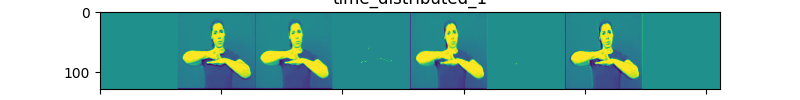
   - **MaxPooling2D:** Reduz as dimensões espaciais pela metade.

   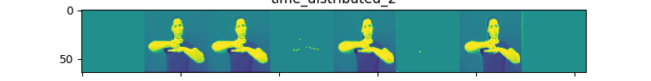


2. **Segunda Sequência de Camadas:**
   ```python
   model.add(TimeDistributed(Conv2D(filters=16, kernel_size=3, activation='relu', padding='same')))
   model.add(TimeDistributed(BatchNormalization()))
   model.add(TimeDistributed(MaxPooling2D(pool_size=2)))
   ```
   - **Conv2D:** 16 filtros com kernel de 3x3. Extrai características mais complexas.

   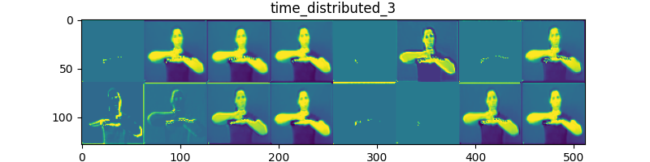
   - **BatchNormalization:** Normaliza as ativações.
   
   - **MaxPooling2D:** Reduz as dimensões espaciais pela metade novamente.
   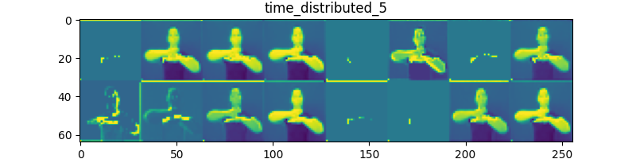

3. **Terceira Sequência de Camadas:**
   ```python
   model.add(TimeDistributed(Conv2D(filters=32, kernel_size=3, activation='relu', padding='same')))
   model.add(TimeDistributed(BatchNormalization()))
   model.add(TimeDistributed(MaxPooling2D(pool_size=2)))
   ```
   - **Conv2D:** 32 filtros com kernel de 3x3. Capta características ainda mais complexas.
   
   - **BatchNormalization:** Normaliza as ativações.
   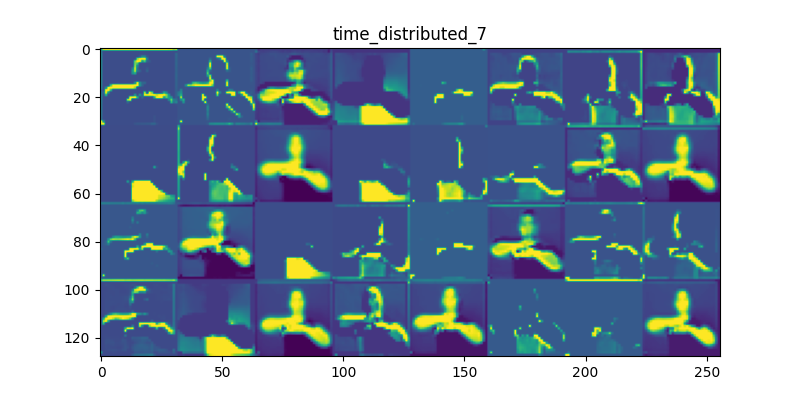
   - **MaxPooling2D:** Reduz as dimensões espaciais pela metade novamente.
   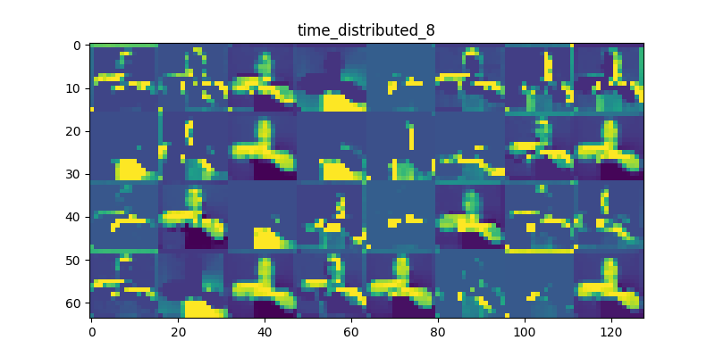

4. **Quarta Sequência de Camadas:**
   ```python
   model.add(TimeDistributed(Conv2D(filters=64, kernel_size=3, activation='relu', padding='same')))
   model.add(TimeDistributed(BatchNormalization()))
   model.add(TimeDistributed(MaxPooling2D(pool_size=2)))
   ```
   - **Conv2D:** 64 filtros com kernel de 3x3. Extrai características de alto nível.
   
   - **BatchNormalization:** Normaliza as ativações.
   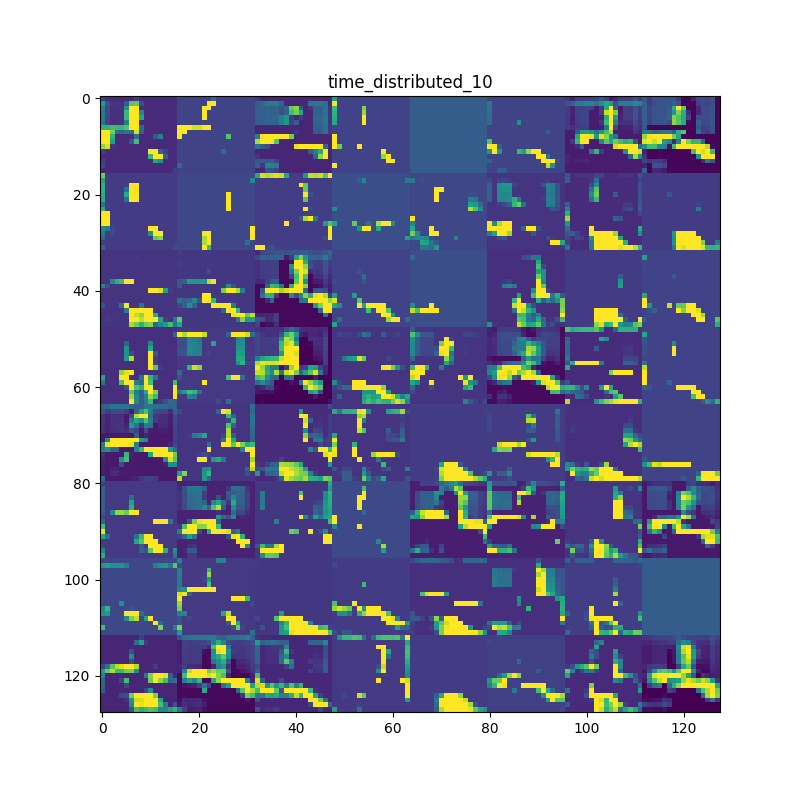
   - **MaxPooling2D:** Reduz as dimensões espaciais pela metade.
   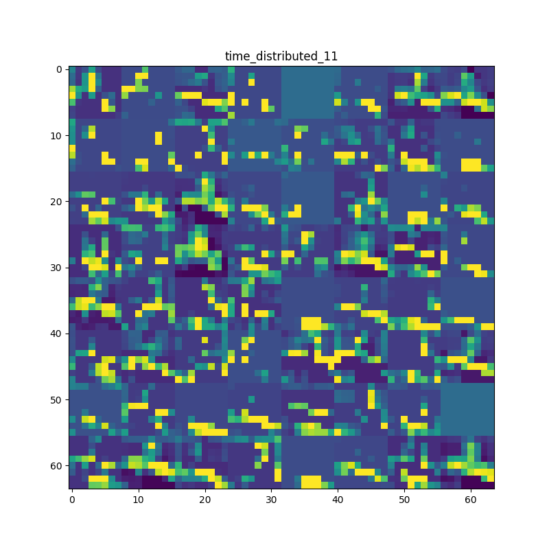

5. **Quinta Sequência de Camadas:**
   ```python
   model.add(TimeDistributed(Conv2D(filters=128, kernel_size=3, activation='relu', padding='same')))
   model.add(TimeDistributed(BatchNormalization()))
   model.add(TimeDistributed(MaxPooling2D(pool_size=2)))
   ```
   - **Conv2D:** 128 filtros com kernel de 3x3. Extrai características de nível ainda mais alto.
   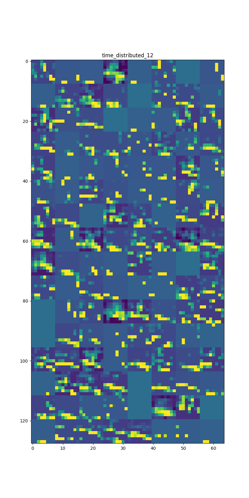
   - **BatchNormalization:** Normaliza as ativações.
   
   - **MaxPooling2D:** Reduz as dimensões espaciais pela metade.
   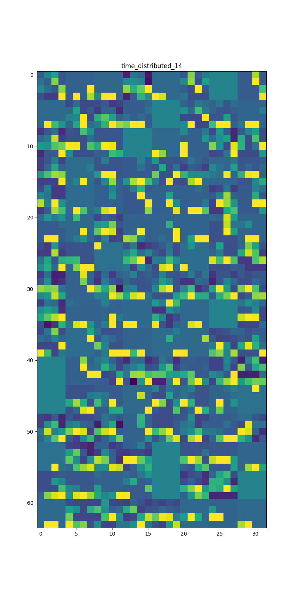

6. **Sexta Sequência de Camadas:**
   ```python
   model.add(TimeDistributed(Conv2D(filters=4, kernel_size=3, activation='relu', padding='same')))
   model.add(TimeDistributed(BatchNormalization()))
   model.add(TimeDistributed(MaxPooling2D(pool_size=2)))
   ```
   - **Conv2D:** 4 filtros com kernel de 3x3. Usado para ajuste fino das características.
   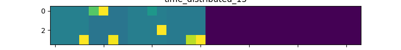
   - **BatchNormalization:** Normaliza as ativações.
   
   - **MaxPooling2D:** Reduz as dimensões espaciais pela metade.
   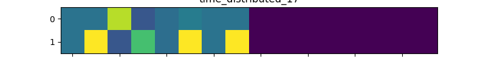

### Flatten e LSTM

1. **Flatten:**
   ```python
   model.add(TimeDistributed(Flatten()))
   ```
   - Achata as ativações 2D para 1D, preparando-as para a entrada na LSTM.

2. **Bidirectional LSTM:**
   ```python
   model.add(Bidirectional(LSTM(100, return_sequences=False)))
   model.add(Dropout(0.5))
   ```
   - **LSTM:** Captura dependências temporais nos frames, processando a sequência de frames.
   - **Bidirectional:** Permite que a LSTM processe a sequência em ambas as direções (frente e verso), capturando melhor as dependências contextuais.
   - **Dropout:** Reduz o overfitting, desativando aleatoriamente 50% dos neurônios durante o treinamento.

### Camadas Dense

1. **Primeira Camada Dense:**
   ```python
   model.add(Dense(128, activation='relu'))
   model.add(Dropout(0.5))
   ```
   - **Dense:** 128 neurônios com ativação ReLU. Aprendizado de características abstratas combinadas.
   - **Dropout:** Reduz o overfitting.

2. **Camada de Saída:**
   ```python
   model.add(Dense(len(labels), activation='softmax'))
   ```
   - **Dense:** Número de neurônios igual ao tamanho do vocabulário, com ativação softmax para classificação das palavras.

### Compilação do Modelo

```python
optimizer = Adam(learning_rate=0.001, clipnorm=1.0)
model.compile(optimizer=optimizer, loss='categorical_crossentropy')
```
- **Adam:** Otimizador que ajusta a taxa de aprendizado com base na primeira e segunda derivada.
- **clipnorm:** Limita a norma dos gradientes para resolver o problema de explosão de gradientes.
- **Loss:** `categorical_crossentropy`, adequada para problemas de classificação multiclasse.

### Sumário do Modelo

```python
model.summary()
```
- Exibe a estrutura do modelo, o número de parâmetros e a configuração das camadas.

### Conclusão

Este modelo processa vídeos de LIBRAS extraindo características espaciais com as camadas Conv2D e características temporais com a LSTM, resultando em uma classificação das palavras baseadas nos frames do vídeo. O uso de TimeDistributed permite aplicar convoluções em cada frame individualmente, e o uso de LSTM captura a dependência temporal entre os frames, essencial para o reconhecimento de gestos em LIBRAS.
Em testes esse modelo foi treinado com um dataset gerando 5 variações para cada video com o auxilio da biblioteca `vidaug`, treinamos e depois testamos com o dataset original sem variações e obtivemos a acuracia:
```python
o modelo teve 82.89473684210526% de acertos
```